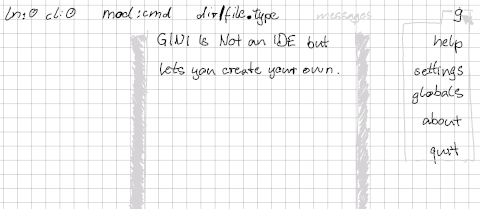

# version 0.1.0

  

## initial program-start showing introductory help page

- If GINI is started inside its git repository help texts from the
  hlp-directory are provided and their modification is stored to this
  directory.  I.e. editing GINI's help files with GINI is going to be
  the first goal.

- If GINI is started outside its git repository help texts from the
  binary embedded hlp-directory are shown.  If the user switches to the
  insert mode a copy of the containing help file is stored in GINI's
  user cache and the help file's modification is stored there.

### determine executed binary in local git repository

Since there will be more functionality needed around directories a "dir"
package is added to encapsulate that functionality.

## minimal context-bar implementation for initial help page

Space activate context bar
- Input of highlighted characters changes the context
- Input of an other Space leaves context bar
  (if no input-box in context bar)

## minimal editor implementation for editing initial help page

- h/j/k/l and cursor-keys move cursor left/down/up/right
- H/L left/right cursor movement until given rune
- J/K up/down cursor movement for given number of lines
- \<delete\> delete character under the cursor
- \<backspace\> delete character before cursor
- \<enter\> add a new line below the current line and go into insert
  mode
- \<shift\>\<enter\> add a new line above the current line and go into
  insert mode.
- \<insert\> or i in command mode switches to insert mode.
- \<insert\> in insert mode switches to overwrite mode.
- \<insert\> in insert-overwrite switches back to insert mode.
- \<esc\>or jk switches back from insert mode to command mode.
- any printable character in insert mode inserts given character
  at current cursor position.
- s saves a modified buffer overwriting its associated file backing the
  overwritten file up.

### file backups

File backups are a simple way to have some protection against mistaken
file modifications.  There may exist up to thousand backups of a single
file.  The default implementation will make up to a hundred backups if
and only if a file has a size of less than a megabyte.

Note in the future there should be a setting for how many backups of a
file are made.  Since this setting should be settable for different
contexts, e.g. on file level, directory level or project level, the
implementation of this setting is delayed until the settings mechanism
is implemented.

Note there should be also a more sophisticated solution for how a backed
up file's size relates to the backup functionality.
